# PathwayAU — Student Workflow & ERD
*Generated: 2026-06-10*

## STUDENT ACTIVITY FLOW (end-to-end, all modules)

```mermaid
flowchart TD
  A[Landing page] --> B[Sign up / Start My PR Journey]
  B --> C["Module 13: Upload myVEVO PDF"]
  C --> D[Platform parses PDF -> verified visa profile]
  D --> E[Contact & study details: institution, course, postcode, dates]
  E --> F[Consent -> account created]
  F --> G[Dashboard]

  G --> H{Course already linked to an ANZSCO code?}
  H -- No --> I["Module 9: Course-to-ANZSCO Matcher\n(course duties -> candidate ANZSCO codes)"]
  H -- Yes --> J
  I --> J["Module 11: Skills Assessment Body Matcher\n(ANZSCO -> ACS/VETASSESS/EA/ANMAC/etc.)"]

  J --> K["Module 3: ANZSCO Shortage Check\n(CSOL/MLTSSL/STSOL/OSL status)"]
  K --> L["Module 8: Points Calculator\n(age, English, education, employment, PY, NAATI, regional study)"]

  L --> M["Module 12: Pathway Matchmaking\nCompare 189 / 190 / 491 / 482 etc.\nPR probability, min points, processing time"]
  M --> N[Student SELECTS candidate pathways]
  N --> O{Compare more / SWAP?}
  O -- Yes --> M
  O -- No --> P[Student LOCKS one pathway]

  P --> Q[Roadmap generated with milestone dates]

  Q --> R["Module 11: Lodge Skills Assessment\n(45-90 day tracker, expiry countdown)"]
  Q --> S["Module 7: English test (IELTS/PTE)\n+ NAATI CCL if applicable"]
  Q --> S2["Module 7: Professional Year enrollment\n(if ICT/Accounting/Engineering)"]

  R --> T{Skills assessment outcome}
  T -- Positive --> U[Module 8: Recalculate points with assessment result]
  T -- Negative --> T1[Show alternative ANZSCO/pathway via Module 12]
  T1 --> M

  S --> U
  S2 --> U

  U --> V["Module 1: Lodge EOI in SkillSelect\n(points + date of effect recorded)"]
  V --> W["Module 1: Monitor invitation rounds\n(live HA browser-extracted data)"]
  W --> X["Module 17: State Nomination Live Status\n(190/491 — open/closed/capped)"]
  X --> Y{Invitation received?}
  Y -- No --> Z{Visa expiry approaching < 60 days?}
  Z -- Yes --> Z1["Module 13: Re-verify visa / consider Bridging Visa or further study (500/485)"]
  Z1 --> Q
  Z -- No --> W

  Y -- Yes --> AA[60-day lodgement window starts]
  AA --> AB["Module 14: Health Examination\n(panel physician, 12-month validity)"]
  AA --> AC["Module 14: Police Clearance Certificates\n(every country lived 12mo+ in last 10yr)"]
  AA --> AD["Module 15: Document Checklist\n(ImmiAccount readiness)"]

  AB --> AE[Lodge PR application in ImmiAccount]
  AC --> AE
  AD --> AE

  AE --> AF["Module 16: Processing Time + Fee Tracker\n(50th/75th/90th percentile, live status)"]
  AF --> AG["Module 7: Bridging Visa A keeps student lawful while waiting"]
  AG --> AH{Visa granted?}
  AH -- No / RFI --> AI[Document checklist update -> resubmit]
  AI --> AF
  AH -- Yes --> AJ["PR GRANTED\n189: live anywhere | 190: 2yr state commitment | 491: 3yr regional -> apply 191"]

  %% Cross-cutting: Module 9 Trust Layer + Module 10 Live Refresh apply to every step
```

**Cross-cutting modules** (apply at every step, not separate screens):
- **Module 9 — Trust/Verification Layer**: every data point shown carries a source + fetch
  timestamp (see Trust/Citation footer in `design_system.md`)
- **Module 10 — Live Refresh Engine**: background jobs refresh ABS/SkillSelect/state lists on
  the schedules defined in `api_audit.md`'s "PLATFORM DATA INGESTION STRATEGY" table
- **Module 13 staleness logic**: re-verification prompts (🟡/🟠/🔴 banners) can interrupt the
  flow at any point per the schedule in `module_13_vevo_verification.md`

---

## ENTITY RELATIONSHIP DIAGRAM

```mermaid
erDiagram
    STUDENT ||--o| VISA_PROFILE : has
    STUDENT ||--o| STUDY_CONTEXT : has
    STUDENT ||--o{ SKILLS_ASSESSMENT : lodges
    STUDENT ||--o{ ENGLISH_TEST_RESULT : has
    STUDENT ||--o{ POINTS_CALCULATION : has
    STUDENT ||--o{ PATHWAY_ASSESSMENT : evaluates
    STUDENT ||--o| EOI : lodges
    STUDENT ||--o{ HEALTH_EXAMINATION : completes
    STUDENT ||--o{ POLICE_CLEARANCE : obtains
    STUDENT ||--o{ DOCUMENT_CHECKLIST_ITEM : tracks

    STUDY_CONTEXT }o--|| INSTITUTION : at
    STUDY_CONTEXT }o--|| COURSE : enrolled_in

    COURSE }o--o{ ANZSCO_OCCUPATION : maps_to

    ANZSCO_OCCUPATION ||--o{ SKILLS_ASSESSMENT : assessed_against
    ANZSCO_OCCUPATION }o--o{ ASSESSING_BODY : assessed_by
    ANZSCO_OCCUPATION ||--o{ OCCUPATION_SHORTAGE_STATUS : has_status
    ANZSCO_OCCUPATION ||--o{ SKILLSELECT_ROUND : appears_in
    ANZSCO_OCCUPATION ||--o{ STATE_NOMINATION : nominated_under

    SKILLS_ASSESSMENT }o--|| ASSESSING_BODY : performed_by

    PATHWAY_ASSESSMENT }o--|| VISA_PATHWAY : evaluates
    PATHWAY_ASSESSMENT }o--|| ANZSCO_OCCUPATION : for_occupation
    PATHWAY_ASSESSMENT ||--o| EOI : becomes

    EOI }o--|| VISA_PATHWAY : for
    EOI }o--|| ANZSCO_OCCUPATION : nominated_occupation

    VISA_PATHWAY ||--o{ SKILLSELECT_ROUND : has_rounds
    VISA_PATHWAY ||--o{ STATE_NOMINATION : has_nominations
    VISA_PATHWAY ||--o{ PROCESSING_TIME_ESTIMATE : has_estimates
    VISA_PATHWAY ||--o{ VISA_FEE : has_fees

    %% Trust layer - generic citation, links to any entity
    DATA_SOURCE_CITATION }o--|| REFRESH_LOG : recorded_by

    STUDENT {
        uuid id PK
        string email
        string given_name
        string family_name
        date birth_date
        datetime created_at
    }

    VISA_PROFILE {
        uuid id PK
        uuid student_id FK
        string visa_subclass
        string visa_class
        date visa_grant_date
        date visa_expiry_date
        string status
        string residence_status
        string immigration_status
        string study_entitlement_status
        string work_entitlement_status
        json study_conditions
        json work_conditions
        bool visa_holder_is_onshore
        enum verification_source "VEVO_API|VEVO_PDF|SELF_REPORT"
        datetime verified_at
        int data_age_days
    }

    STUDY_CONTEXT {
        uuid id PK
        uuid student_id FK
        uuid institution_id FK
        uuid course_id FK
        date course_start
        date course_end_expected
        string location_postcode
        bool regional_bonus_eligible
    }

    INSTITUTION {
        uuid id PK
        string name
        string cricos_provider_code
        string state
    }

    COURSE {
        uuid id PK
        string cricos_course_code
        string name
        string level
        uuid institution_id FK
    }

    ANZSCO_OCCUPATION {
        string code PK
        string title
        string unit_group
        int skill_level
    }

    ASSESSING_BODY {
        uuid id PK
        string name
        string website_url
    }

    SKILLS_ASSESSMENT {
        uuid id PK
        uuid student_id FK
        string anzsco_code FK
        uuid assessing_body_id FK
        string status
        date lodged_date
        date outcome_date
        date expiry_date
        string outcome
    }

    ENGLISH_TEST_RESULT {
        uuid id PK
        uuid student_id FK
        string test_type "IELTS|PTE|TOEFL|OET"
        json scores
        date test_date
        date expiry_date
        string proficiency_level
    }

    POINTS_CALCULATION {
        uuid id PK
        uuid student_id FK
        datetime calculated_at
        int total_points
        json breakdown
        string source_citation
    }

    VISA_PATHWAY {
        string code PK "189|190|491|482|485|..."
        string name
        json base_requirements
    }

    PATHWAY_ASSESSMENT {
        uuid id PK
        uuid student_id FK
        string pathway_code FK
        string anzsco_code FK
        float pr_probability
        int min_points_required
        string processing_time_estimate
        enum status "candidate|selected|locked"
        datetime locked_at
    }

    EOI {
        uuid id PK
        uuid student_id FK
        string pathway_code FK
        string anzsco_code FK
        int points_at_lodgement
        date date_of_effect
        string status
    }

    SKILLSELECT_ROUND {
        uuid id PK
        string pathway_code FK
        string anzsco_code FK
        date round_date
        int occupation_ceiling
        int min_points_invited
        string source_url
        datetime fetched_at
    }

    STATE_NOMINATION {
        uuid id PK
        string state
        string pathway_code FK
        string anzsco_code FK
        enum status "open|closed|capped"
        datetime fetched_at
    }

    OCCUPATION_SHORTAGE_STATUS {
        uuid id PK
        string anzsco_code FK
        enum list_type "CSOL|MLTSSL|STSOL|OSL|SPL"
        string status
        string source_url
        datetime fetched_at
    }

    HEALTH_EXAMINATION {
        uuid id PK
        uuid student_id FK
        string panel_physician
        date exam_date
        string result_status
        date expiry_date
    }

    POLICE_CLEARANCE {
        uuid id PK
        uuid student_id FK
        string country
        date issued_date
        string status
    }

    DOCUMENT_CHECKLIST_ITEM {
        uuid id PK
        uuid student_id FK
        string document_type
        string status
        datetime uploaded_at
    }

    PROCESSING_TIME_ESTIMATE {
        uuid id PK
        string pathway_code FK
        int percentile_50_days
        int percentile_75_days
        int percentile_90_days
        datetime fetched_at
    }

    VISA_FEE {
        uuid id PK
        string pathway_code FK
        decimal base_fee_aud
        date effective_date
        string source_url
    }

    DATA_SOURCE_CITATION {
        uuid id PK
        string entity_type
        uuid entity_id
        string source_name
        string source_url
        datetime fetched_at
    }

    REFRESH_LOG {
        uuid id PK
        string source_name
        datetime fetched_at
        string status
        int records_updated
    }
```

### Notes on the ERD

- **`VISA_PROFILE`** is the Module 13 output — one row per student, refreshed on
  re-verification (history could be kept in an audit table if needed later, not MVP).
- **`DATA_SOURCE_CITATION`** is generic/polymorphic (`entity_type` + `entity_id`) so any
  table (points calc, shortage status, SkillSelect round, etc.) can carry a source +
  timestamp without duplicating those columns everywhere — but high-traffic tables
  (`SKILLSELECT_ROUND`, `OCCUPATION_SHORTAGE_STATUS`, `STATE_NOMINATION`) already embed
  `source_url`/`fetched_at` directly for query performance.
- **`PATHWAY_ASSESSMENT.status`** drives the SELECT/SWAP/LOCK UI in `design_system.md`
  Screen 4 — `candidate` (shown in comparison), `selected` (chosen by student, can swap),
  `locked` (final, generates roadmap).
- **`COURSE` ↔ `ANZSCO_OCCUPATION`** many-to-many supports both directions of GAP 9
  (course → ANZSCO and ANZSCO → course).
